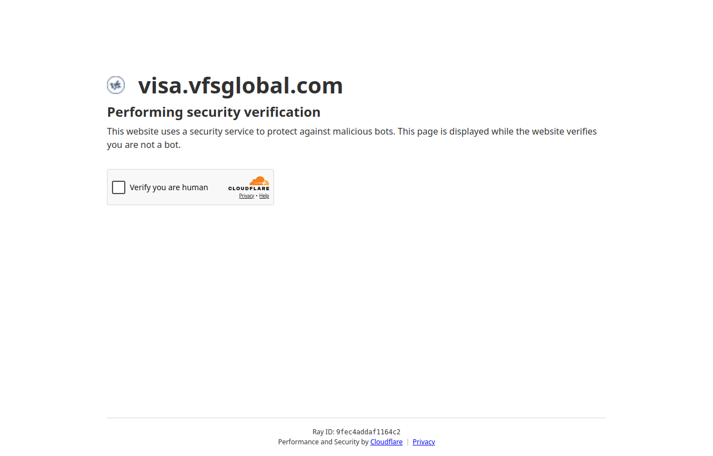
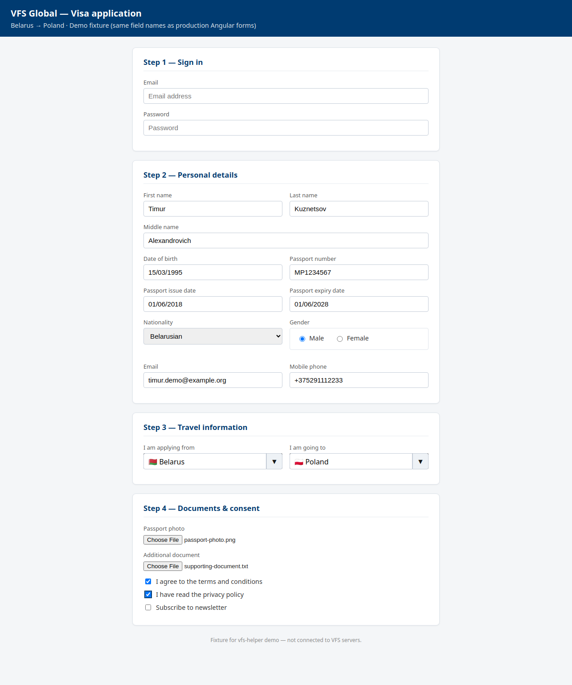
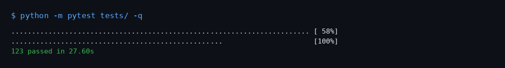
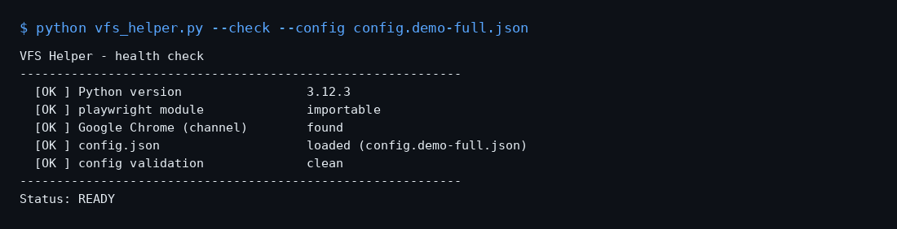
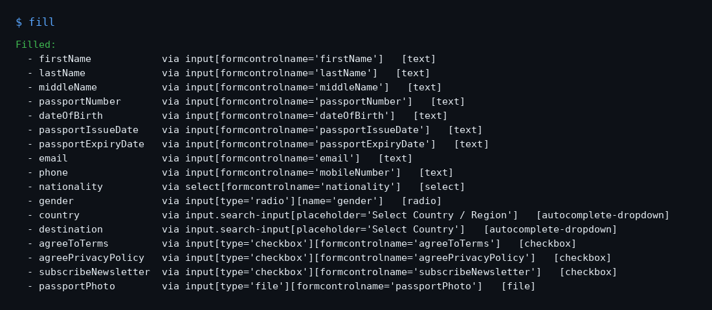
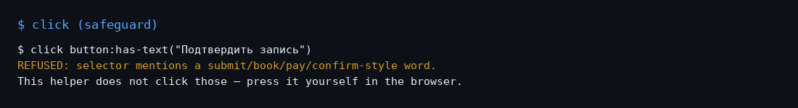

# VFS Helper

[](https://github.com/timur123-star/-/actions/workflows/tests.yml)

**Human-in-the-loop ассистент для форм VFS Global** — ускоряет ручную подачу
визовой заявки: вы проходите Cloudflare и логин сами, а поля анкеты
заполняются из локального `config.json` одной командой `fill`.

Стек: **Python 3.10+**, **Playwright**, **Google Chrome**, Angular Material
(`mat-select`, `matDatepicker`), кастомные `.autocomplete-search-box`
(как на vfsglobal.com), чекбоксы, radio, загрузка файлов. CI: GitHub Actions,
**123** автотеста.

> Проект в портфолио: демонстрация автоматизации реальных веб-форм без обхода
> CAPTCHA и без автоклика по «Подтвердить / Оплатить».

## Скриншоты

### Реальный сайт — выбор страны (vfsglobal.com)

Автозаполнение dropdown «откуда / куда» на продакшн-странице VFS Global:


### Реальный портал записи (visa.vfsglobal.com)

Стартовая страница маршрута Belarus → Poland. Cloudflare проходит пользователь
вручную один раз; сессия сохраняется в `browser_profile/`.



### Все типы полей анкеты

Один проход `fill`: текст, select, autocomplete, checkbox, radio, файлы.
Разметка соответствует Angular-форме VFS (`formcontrolname`, те же виджеты):



### Терминал

| Тесты | Health-check | Команда `fill` | Safeguard |
|:-----:|:------------:|:--------------:|:---------:|
|  |  |  |  |

Пересобрать скриншоты: `python scripts/capture_portfolio_screenshots.py`

## Быстрый старт (Windows, 3 шага)

1. Скачайте проект (зелёная кнопка **Code** → **Download ZIP**) и распакуйте
   в любую папку, например `C:\vfs-helper\`.
2. Дважды кликните **`setup.bat`** — поставит Python-зависимости, скачает
   Chromium-fallback, проверит что Google Chrome установлен и сразу запустит
   мастер заполнения данных.
3. Дважды кликните **`run.bat`** — откроется Chrome на странице VFS, дальше
   действуете по подсказкам в чёрном окне терминала (`fill`, `inspect`,
   `wait`, `click`, `quit`).

Если Python 3 не установлен — `setup.bat` подскажет ссылку
[python.org/downloads](https://www.python.org/downloads/). Google Chrome
качается с [google.com/chrome](https://www.google.com/chrome/).

## Что делает (и чего НЕ делает)

Делает:

- Открывает настоящий Google Chrome через Playwright с сохранением профиля
  между запусками (`browser_profile/`), чтобы не логиниться каждый раз и
  чтобы Cloudflare запоминал, что это «нормальный» браузер.
- По команде `fill` заполняет видимые поля значениями из конфига. Умеет:
  - **обычные `<input>` / `<textarea>` / `<select>`** — посимвольный ввод
    с диспатчем `input` / `change` / `blur` событий, чтобы Angular
    зарегистрировал значение в `FormControl` (без этого значение часто
    остаётся «pristine» и теряется при сабмите);
  - **Angular Material `<mat-select>`** — клик по селекту → ожидание CDK-
    оверлея с `mat-option` → клик по нужной опции по тексту;
  - **кастомные autocomplete-dropdown** с классами `.autocomplete-search-box`
    / `.search_dropdown` (используются на vfsglobal.com и многих
    корпоративных Angular-CMS) — клик по toggle-кнопке для открытия,
    посимвольный ввод в `.search-input`, клик по нужному `<li>` в списке.
    Это снимает проблему когда `.selected-wrapper` оверлей перехватывает
    обычный `locator.click()`.
- По команде `inspect` показывает все видимые поля на странице с их
  `formControlName`, `ng-reflect-name`, ассоциированным `mat-label` и т.д. —
  для подбора селекторов под конкретный шаг формы.
- По команде `wait <selector>` ждёт появления элемента (удобно после
  ручного логина).
- По команде `click <selector>` кликает по элементу, но **жёстко
  отказывается** кликать всё, что похоже на submit / book / pay / confirm /
  подать / записаться / подтвердить / оплатить / бронировать / готово (см.
  `DANGEROUS_CLICK_PATTERN` в `vfs_helper.py` и тесты в
  `tests/test_safeguard.py`).
- Делает скриншот (`screenshot`) и дамп HTML (`dump`) текущей страницы — на
  случай если что-то не нашлось и нужно показать разработчику.
- Ведёт лог в `logs/vfs-helper-<timestamp>.log` (каждый `fill` / `click` /
  ошибка пишутся туда).
- Валидирует конфиг при старте: предупреждает о датах в неверном формате,
  невалидном email/телефоне и «забытых» примерных значениях типа `Ivan
  Ivanov` или `REPLACE_WITH_YOUR_PASSWORD`.

НЕ делает:

- Не решает CAPTCHA, не обходит Cloudflare / Turnstile. Это всё на вас.
- Не нажимает «Записаться», «Отправить», «Оплатить», «Подтвердить» и любые
  другие кнопки подтверждения — даже если случайно ввести их селектор в
  `click`.
- Не запускает циклы опроса, не «ловит» слоты, не работает в фоне.
- Никуда ничего не отправляет: всё локально, `config.json` лежит у вас на диске.

## А на реальном сайте VFS это работает?

Короткий ответ: **да, для заполнения форм работает. Cloudflare-вход вы
проходите руками — один раз.**

1. **Cloudflare Turnstile при входе.** Скрипт включает
   `--disable-blink-features=AutomationControlled`, init-скрипт,
   который скрывает `navigator.webdriver` и прочие маркеры автоматизации, и
   использует **настоящий установленный Chrome** (channel=chrome), а не
   bundled Chromium. Этого хватает, чтобы Turnstile перестал постоянно
   сбрасывать чекбокс, но не достаточно, чтобы он сам пропускал нас. На
   первом запуске вы один раз кликаете чекбокс рукой. Cloudflare выдаёт
   сессионную cookie, она сохраняется в `browser_profile/`. На следующих
   запусках Turnstile уже узнаёт сессию и обычно даже не показывает чекбокс.
2. **Форма после логина** — Angular Material SPA. Поля это не простые
   `<input name="firstName">`, а `<input formcontrolname="firstName"
   matInput>`. Дефолтные селекторы в `config.example.json` уже на это
   рассчитаны. Если на каком-то шаге форма поменялась — `inspect`, обновили
   `fields`, поехали дальше.
3. **`mat-select`** (гражданство, тип визы и т.п.) — скрипт распознаёт их и
   корректно открывает: кликает по `mat-select`, дожидается появления
   `mat-option`-оверлея, кликает по нужной опции по тексту.
4. **Даты** (`matDatepicker`) — лучше заполнять текстовое поле инпута в
   формате `DD/MM/YYYY` с включённым `typing.simulate_human=true` (по
   умолчанию). Так дата вводится посимвольно как с клавиатуры, и это
   надёжнее, чем кликать по календарю.
5. **Чего точно не будет** — автобронирования слота. Это сознательное
   решение, не техническое ограничение: автобронь нарушает ToS, ловит бан
   на аккаунт (а аккаунт привязан к паспорту), требует постоянных расходов
   на 2captcha/AntiCaptcha и всё равно проигрывает другим ботам. Этот
   скрипт делает то, что реально работает: вы вручную ловите свободное
   окно, а как только попали — поля заполняются за полсекунды, и вы
   успеваете нажать «Подтвердить» до того, как кто-то другой займёт слот.

## Установка (вариант для разработчиков)

Требуется Python 3.10+ и установленный Google Chrome.

```bash
# Windows
git clone https://github.com/timur123-star/-.git vfs-helper
cd vfs-helper
setup.bat
```

```bash
# macOS / Linux
git clone https://github.com/timur123-star/-.git vfs-helper
cd vfs-helper
bash setup.sh
```

Скрипт `setup.bat` / `setup.sh` сам:

1. Создаёт виртуальное окружение в `.venv/`.
2. Ставит `playwright` через pip.
3. Скачивает bundled-Chromium как fallback (`python -m playwright install chromium`).
4. Запускает диагностику (`python vfs_helper.py --check`).
5. Запускает мастер заполнения конфига (`python vfs_helper.py --setup`).

## CLI-флаги

```text
python vfs_helper.py [--config PATH] [--setup] [--check] [--example-config]
                     [--no-stealth]
```

| Флаг               | Что делает                                                |
| ------------------ | --------------------------------------------------------- |
| (без флагов)       | Запустить браузер и REPL.                                 |
| `--setup`          | Интерактивный мастер: задаёт вопросы, пишет `config.json`. |
| `--check`          | Health-check: Python, Playwright, Chrome, конфиг.         |
| `--example-config` | Вывести шаблон конфига в stdout.                          |
| `--config PATH`    | Использовать другой путь к конфигу.                       |
| `--no-stealth`     | Отключить stealth init script (для отладки).              |

## Команды в REPL

| Команда                          | Что делает                                                              |
| -------------------------------- | ----------------------------------------------------------------------- |
| `fill` или `f [profile]`         | Заполнить поля формы (текст, select, mat-select, autocomplete-dropdown, checkbox, radio, файлы). С `profile` — селекторы из `profiles.<name>` берутся первыми. |
| `inspect` или `i`                | Распечатать все видимые поля на текущей странице с Angular-атрибутами.  |
| `upload <selector> <path>`       | Прикрепить файл к `<input type='file'>`. Путь относительно репо или абсолютный. |
| `wait <sel> [ms]`                | Дождаться появления селектора (по умолчанию 10000ms).                   |
| `click <sel>`                    | Кликнуть. **Отказывается** кликать submit/book/pay/confirm/подать/записаться/подтвердить/оплатить/бронировать/готово. |
| `cookies show`                   | Распечатать cookies текущего контекста.                                 |
| `cookies save [path]`            | Экспортировать cookies в JSON (по умолчанию `cookies/cookies-<ts>.json`). |
| `cookies load <path>`            | Импортировать cookies из JSON-файла в контекст.                         |
| `cookies clear`                  | Удалить все cookies контекста.                                          |
| `goto <url>`                     | Перейти по ссылке.                                                      |
| `scroll [down|up|top|px]`        | Прокрутить страницу (длинные анкеты).                                  |
| `screenshot`, `s`                | Сохранить скриншот страницы в `screenshots/`.                           |
| `dump`                           | Сохранить HTML текущей страницы в `dumps/` для разбора оффлайн.         |
| `reload`, `r`                    | Обновить страницу.                                                      |
| `url`                            | Показать текущий URL.                                                   |
| `tabs`                           | Список открытых вкладок с URL.                                          |
| `help`, `?`                      | Показать список команд.                                                 |
| `quit`, `q`                      | Закрыть браузер и выйти.                                                |

Скрипт работает с **последней открытой вкладкой**, так что если форма VFS
открывается в новой вкладке — просто переключитесь на неё в браузере, и `fill`
сработает там.

## Структура конфига

```json
{
  "start_url": "https://visa.vfsglobal.com/blr/ru/pol/login",

  "user": {
    "firstName": "...",
    "lastName": "...",
    "passportNumber": "MP1234567",
    "dateOfBirth": "15/03/1995",
    "email": "you@example.com",
    "phone": "+375291234567",
    "nationality": "Belarusian",
    "gender": "Male",
    "loginEmail": "you@example.com",
    "loginPassword": "..."
  },

  "fields": {
    "firstName": [
      "input[formcontrolname='firstName']",
      "input[name='firstName']",
      "input[id*='firstName' i]"
    ]
  },

  "profiles": {
    "login": {
      "loginEmail": ["input[formcontrolname='username']"],
      "loginPassword": ["input[formcontrolname='password']"]
    }
  },

  "browser": {
    "channel": "chrome",
    "headless": false,
    "viewport": { "width": 1366, "height": 900 },
    "user_data_dir": "browser_profile",
    "locale": "ru-RU"
  },

  "typing": {
    "simulate_human": true,
    "keystroke_delay_ms": 30
  }
}
```

### Профили под разные шаги формы

VFS — это многошаговая форма (логин → выбор центра → анкета → выбор слота). На
каждом шаге могут встречаться поля с одним и тем же именем (например, `email`
на логине и `email` в анкете), но с разными селекторами. Для этого есть
`config.profiles`:

В терминале: `fill login` — сначала пробует селекторы из `profiles.login`,
потом fallback на топ-уровневые `fields`.

## Запись экрана (опционально)

Если нужен ролик для презентации — `record_real.bat` / `record_real.sh`
(требуется `ffmpeg` в PATH). После ручного прохождения Cloudflare и открытия
анкеты нажмите Enter в терминале: скрипт выполнит
`inspect → scroll → fill → screenshot → quit` и сохранит MP4 в `artifacts/`.

## Тесты

```bash
pip install -r requirements-dev.txt
pytest -v
```

Тесты не требуют Playwright-браузеров: проверяют только чистую логику —
загрузку конфига, резолв селекторов с учётом профилей, валидацию
дат/email/телефона/плейсхолдеров, мастер `--setup` (через monkeypatched stdin),
и логику отказа кликать submit/book/pay/confirm-кнопки на русском и
английском.

В репозитории **123 теста** (~30 с с браузерными интеграционными). Покрыты
конфиг, safeguard, autocomplete-dropdown, checkbox / radio / file upload,
cookies, полная форма.

## Структура проекта

```
vfs-helper/
├── README.md
├── requirements.txt           # рантайм-зависимости
├── requirements-dev.txt       # + pytest для тестов
├── setup.bat / setup.sh       # one-click установка
├── run.bat / run.sh           # one-click запуск
├── record_real.bat / .sh      # опциональная запись экрана (ffmpeg)
├── config.example.json        # шаблон конфига
├── config.demo-full.json      # пример со всеми полями анкеты
├── config.json                # ваши данные, в .gitignore
├── docs/screenshots/          # иллюстрации для README
├── fixtures/                  # HTML для тестов и снимка «все типы полей»
├── vfs_helper.py              # основной скрипт
├── tests/                     # pytest (123)
├── scripts/
│   ├── capture_portfolio_screenshots.py
│   └── record_real_runner.py
├── browser_profile/           # профиль Chrome, в .gitignore
├── screenshots/               # скриншоты по команде `screenshot`
├── dumps/                     # HTML-дампы по команде `dump`
└── logs/                      # логи запусков
```

## Принципы

- Никакого обхода защиты. CAPTCHA и Cloudflare проходит только человек.
- Никакой автоматической отправки. Скрипт только заполняет поля и
  (опционально) открывает дропдауны / переходит между шагами; кнопки
  подтверждения жмёт пользователь.
- Никаких фоновых циклов и polling-а слотов.
- Все персональные данные хранятся локально в `config.json`, никуда не
  отправляются.

## Архитектура

```
+--------------------+      +---------------------+      +----------------+
|  config.json       |----->|  vfs_helper.py      |<---->|  Chromium /    |
|  (your data)       |      |  - REPL             |      |  Google Chrome |
|  - user            |      |  - fill engine      |      |  (Playwright)  |
|  - fields          |      |  - safeguard        |      |                |
|  - profiles        |      |  - logging          |      |                |
+--------------------+      +----------+----------+      +-------+--------+
                                       |                          |
                                       v                          v
                         +-------------+-------------+   +--------+--------+
                         |  fill dispatcher          |   |  browser_profile|
                         |                           |   |  (persistent)   |
                         |  - text input             |   +--------+--------+
                         |  - <select>               |            |
                         |  - <mat-select>           |            v
                         |  - autocomplete-search-box|   +--------+--------+
                         |  - checkbox               |   |  Cloudflare     |
                         |  - radio (group)          |   |  cookie (set    |
                         |  - <input type=file>      |   |  once by hand)  |
                         +---------------------------+   +-----------------+

  +-----------------+
  |  logs/          |   structured rotating log + per-session log
  +-----------------+
  |  screenshots/   |   on demand
  |  dumps/         |   on demand
  |  cookies/       |   export / import via cookies command
  +-----------------+
```

Один Python-скрипт `vfs_helper.py` — диспатчер, который по типу элемента
(`<input>`, `<select>`, `mat-select`, `.autocomplete-search-box`, `[type=file]`,
`[type=checkbox]`, `[type=radio]`) выбирает соответствующую стратегию ввода.
Браузерный профиль (`browser_profile/`) хранит Cloudflare-cookie и сессию VFS
между запусками.

## Часто задаваемые вопросы (FAQ)

**В.: Скрипт перестал заходить на VFS, пишет «Один момент…».**
О.: Cloudflare сбросил cookie. Откройте `https://visa.vfsglobal.com/blr/ru/pol/login`
в обычном Chrome, пройдите чекбокс, потом снова запустите `run.bat`. Cookie
автоматически попадёт в `browser_profile/` и будет переиспользоваться. Если
вы запускаете на другой машине — используйте `cookies save` после прохождения
чекбокса на одной, скопируйте файл на вторую, `cookies load` там.

**В.: `fill` пишет «no visible field on this page».**
О.: Angular ещё не загрузил форму. Запустите `wait input[formcontrolname='...']`
с подходящим селектором — это подождёт до 10 секунд. Если поле всё равно
не появляется — посмотрите реальные атрибуты через `inspect` и обновите
`config.fields`.

**В.: Поле пропускается с «not editable (disabled/readonly?)».**
О.: VFS показывает поле, но Angular пометил его `disabled`. Обычно это значит,
что вы ещё не выбрали что-то на предыдущем шаге (например, тип визы). Откройте
выпадающий список руками или используйте `fill` с предварительным шагом.

**В.: После `fill` поле визуально заполнено, но при сабмите форма ругается
«поле обязательно».**
О.: Это классическая Angular-проблема — `FormControl` не получил
`input/change` событий и остался `pristine`. Helper их диспатчит, но если
форма использует кастомный валидатор на blur — нажмите `Tab` в браузере
после `fill`, или добавьте `click body` после `fill`.

**В.: Что произойдёт если случайно нажать `click button:has-text("Submit")`?**
О.: Ничего. `click` имеет двухуровневый safeguard: проверяется и текст
селектора, и `inner_text` найденного элемента. Если что-то совпадает с
блок-листом (`submit/book/pay/confirm/подтвердить/оплатить/...`) — клик
отменяется и в терминале пишется `REFUSED:` с пояснением.

**В.: Куда писать паспортное фото?**
О.: В `user.passportPhoto` укажите путь к файлу (абсолютный или
относительно репозитория). Helper автоматически вызовет
`set_input_files()` на `<input type='file'>` с подходящим селектором.
Также можно из REPL: `upload input[type='file'] path/to/photo.jpg`.

**В.: Хочу автоматическое бронирование слотов 24/7.**
О.: Это другой проект. Этот скрипт сознательно не делает автобронь:
автобронь нарушает ToS VFS, банит аккаунт (а аккаунт привязан к паспорту),
требует постоянных расходов на 2captcha (300-500 ₽/мес.) и проигрывает
другим ботам в борьбе за слоты. Этот инструмент решает реальную проблему —
успеть ввести данные быстрее других — без этих рисков.

## Troubleshooting

| Симптом                                                | Что делать                                                                                  |
| ------------------------------------------------------ | ------------------------------------------------------------------------------------------- |
| `setup.bat` падает с «Python launcher не найден»       | Установите Python 3.10+ с [python.org](https://www.python.org/downloads/), отметив «Add to PATH». |
| `playwright install chromium` падает по сети           | Возможно прокси / VPN режет CDN. Запустите без прокси, либо `pip install playwright==1.47.0` затем `python -m playwright install chromium`. |
| `--check` пишет `Google Chrome (channel) not found`    | Установите Google Chrome с [google.com/chrome](https://www.google.com/chrome/). Helper использует bundled Chromium как fallback. |
| Cloudflare возвращает «Один момент…» снова и снова     | Откройте VFS в обычном Chrome, пройдите чекбокс вручную, перезапустите `run.bat`. Cookie сохранится в `browser_profile/`. При смене сети — `cookies save` / `cookies load`. |
| `fill` промахивается по полю                           | Запустите `inspect`, скопируйте `formcontrolname` или `id` в `config.fields`. Helper попробует селекторы по очереди.                       |
| `mat-select` открывается, но не выбирается             | Текст опции может отличаться от того, что в `user.<key>` (например, `Belarus` vs `Belarusian`). Через `inspect` смотрите реальный текст в выпадающем. |
| Поле «date of birth» принимает только календарь        | Используйте `typing.simulate_human=true` и формат `DD/MM/YYYY` — Angular Material datepicker обычно принимает текстовый ввод параллельно с календарём. |
| Логи разрослись на 100+ МБ                             | `logs/vfs-helper.log` ротируется автоматически (10 МБ x 5 backups). Per-session логи (`vfs-helper-<timestamp>.log`) можно безопасно чистить вручную. |
